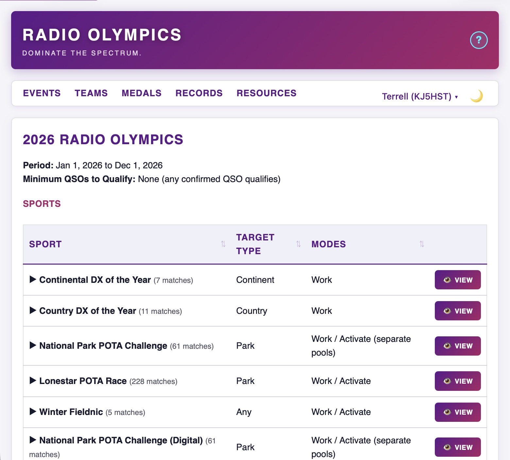
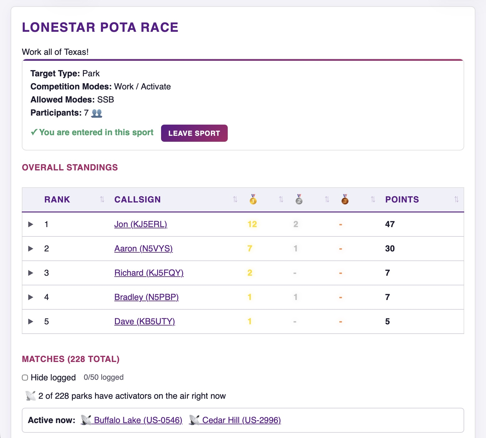
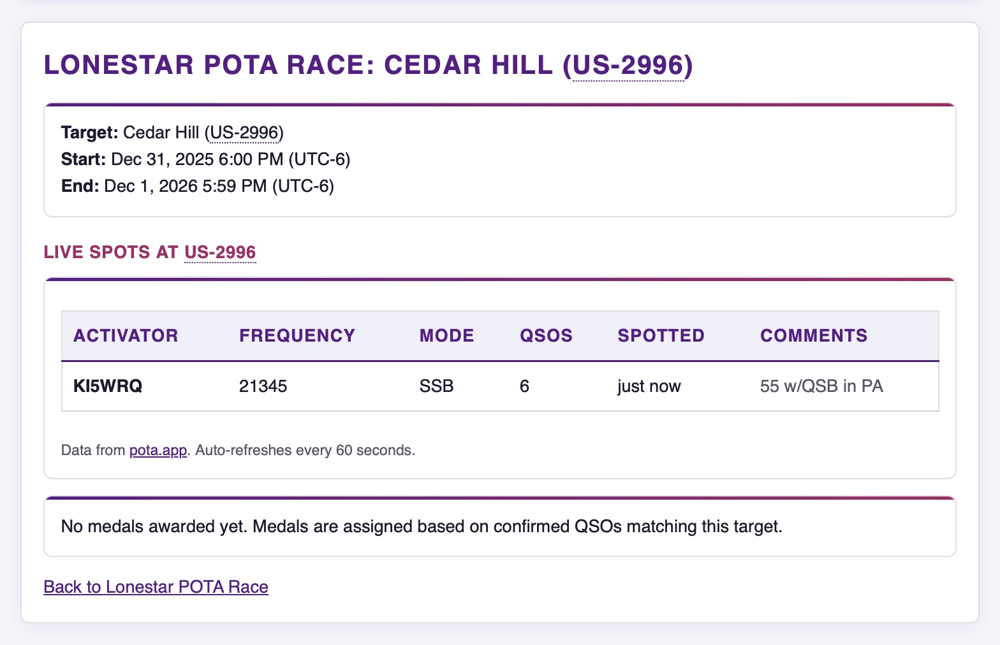
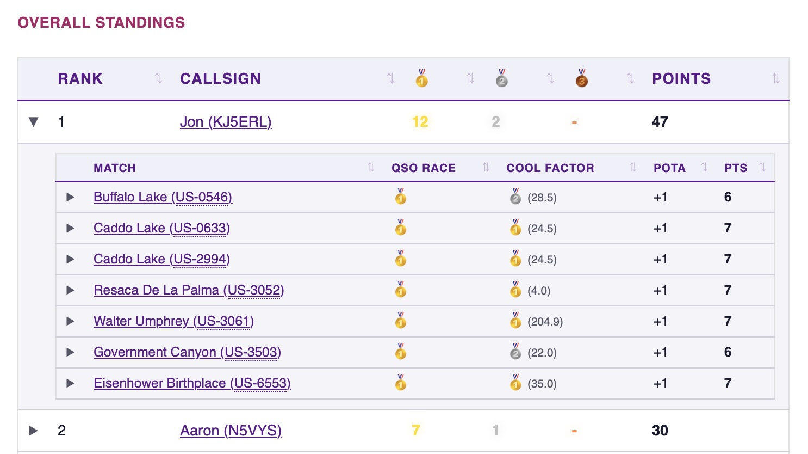
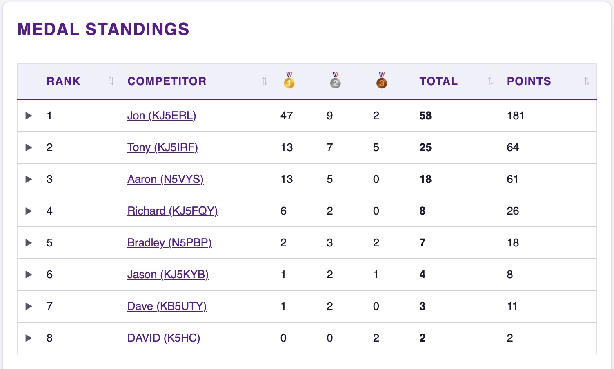
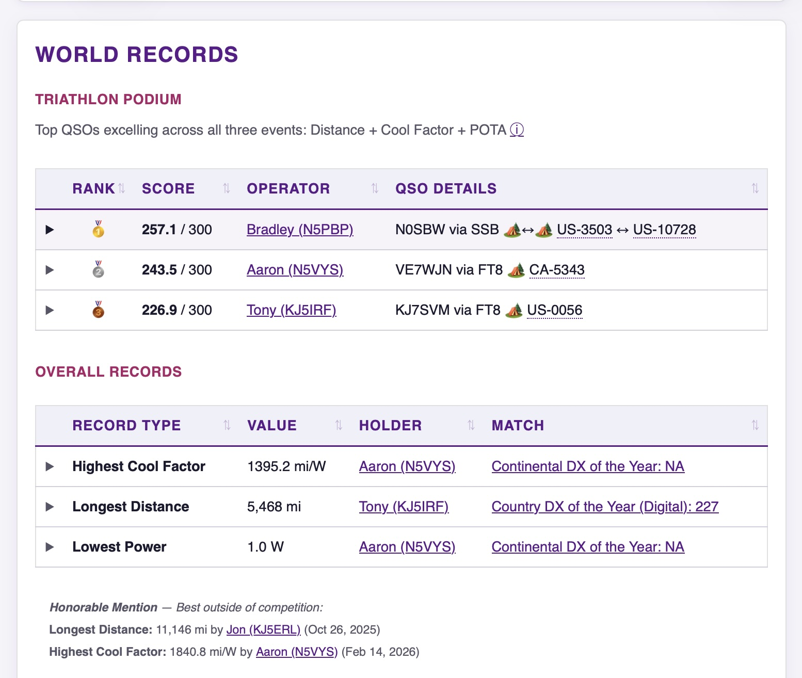
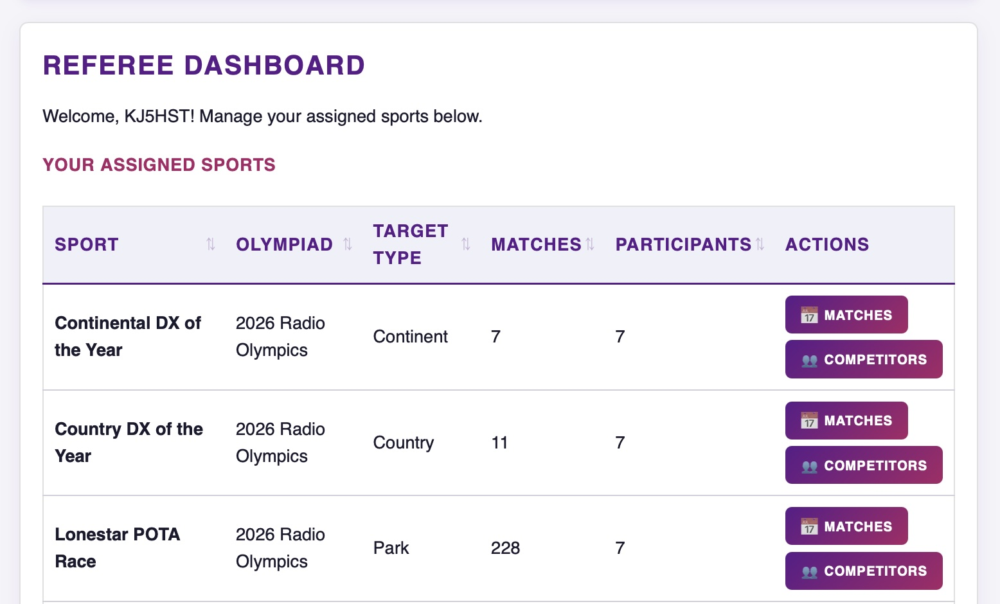
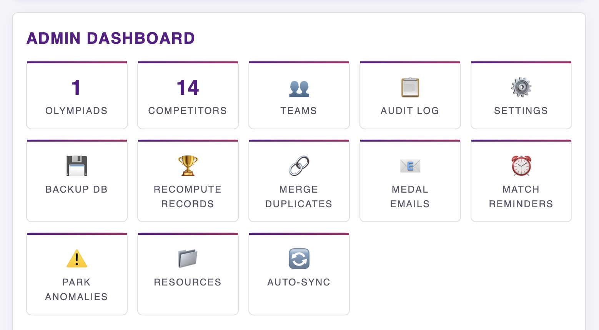

# Ham Radio Olympics

Amateur radio competition server with LoTW and QRZ Logbook integration.

**[Full Documentation](docs/README.md)** | **[User Guide](docs/USER_GUIDE.md)** | **[Changelog](docs/CHANGELOG.md)** | **[Email Setup](docs/EMAIL_SETUP.md)**

## Screenshots

| | |
|---|---|
|  |  |
| *Olympiad overview with all sports* | *Sport standings with live POTA spots* |
|  |  |
| *Match detail with live activator spots* | *Expanded per-match medal breakdown* |
|  |  |
| *Overall medal standings* | *World records and Triathlon podium* |
|  |  |
| *Referee dashboard for sport management* | *Admin control panel* |

## Quick Start

```bash
pip install -r requirements.txt
export ENCRYPTION_KEY="your-secret-key"
export ADMIN_KEY="your-admin-key"
python -m uvicorn main:app --reload
```

See [docs/README.md](docs/README.md) for complete documentation.

## Important Note for World Radio League (WRL) Users

**Do NOT use the direct WRL → QRZ integration** for syncing logs. There is a bug that strips POTA data (SIG/SIG_INFO fields). Instead:

1. Export ADIF from WRL manually
2. Import the ADIF file into QRZ manually
3. Then sync from Ham Radio Olympics

See the [User Guide](docs/USER_GUIDE.md) for details.
